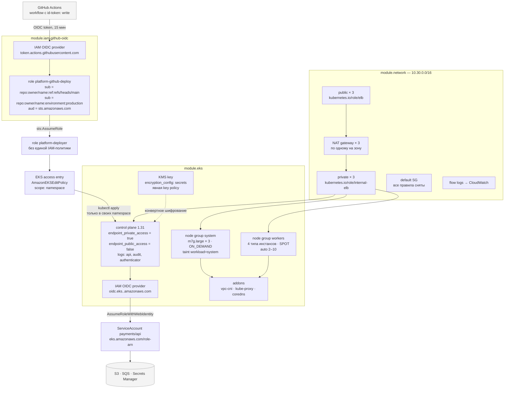

# terraform-aws-modules

Библиотека переиспользуемых Terraform-модулей для AWS: сеть, EKS, RDS PostgreSQL,
S3 + CloudFront и роль для GitHub Actions через OIDC — с типизированными входами,
валидацией, проверенной против схемы провайдера, и полным набором линтеров в CI.

## Задача

AWS-инфраструктура редко начинается с библиотеки. Она начинается с каталога `terraform/`,
в котором лежат `vpc.tf`, `eks.tf`, `rds.tf`. Появляется второй проект — каталог копируется.
Появляется третий — копируется снова. Дальше начинается то, ради чего этот репозиторий
и существует.

**VPC каждый раз собирается чуть иначе.** В одном проекте приватные подсети `/20`,
в другом `/24` и через полгода в них не помещается ни один узел EKS. В одном включены
flow-логи, в другом их забыли, и разбор инцидента упирается в отсутствие данных. В одном
NAT-шлюз один на всю сеть, в другом три — и никто не помнит, было ли это решением.

**Дефолтная security-группа остаётся живой.** AWS создаёт её вместе с VPC, удалить её
нельзя, и она разрешает любой трафик между своими участниками. Всё, что запущено без явно
указанной группы, попадает именно туда. Об этом знают все и вспоминают немногие.

**Ошибка тиражируется вместе с копией.** Забытое правило lifecycle на версионированном
бакете — это счёт за хранение, растущий линейно и незаметно; в трёх копиях он растёт втрое.
Группа узлов на SPOT с одним типом инстанса исчезает целиком; в трёх копиях исчезает
трижды.

**Эксплуатационное знание не фиксируется.** Что доставка логов CloudFront ломается на
бакете с `BucketOwnerEnforced`, знает один человек, который однажды потратил на это день.
В коде этого нет, в ревью это не всплывает, в следующем проекте это повторится.

Модуль решает это не «переиспользованием кода» как самоцелью. Он решает это тем, что
переводит знание в проверяемое ограничение. Если SPOT-группа обязана иметь больше одного
типа инстанса — это `validation`, а не абзац в Confluence. Если окна бэкапа и обслуживания
RDS не должны пересекаться, `terraform plan` падает сразу, а не через четыре минуты
ожидания ответа от API.

Второе следствие: интерфейс модуля становится документацией. Таблицы входов и выходов в
README каждого модуля генерируются `terraform-docs` из кода, и CI падает, если они
разошлись.

## Каталог модулей

| Модуль | Назначение | Ключевые входы |
|---|---|---|
| [`network`](modules/network) | VPC, три уровня подсетей по зонам, IGW, NAT, flow-логи, обезвреженная default SG | `azs`, `public_subnet_cidrs`, `private_subnet_cidrs`, `intra_subnet_cidrs`, `single_nat_gateway` |
| [`eks`](modules/eks) | Кластер EKS: доступ к API, KMS-шифрование Secrets, OIDC для IRSA, группы узлов, аддоны | `kubernetes_version`, `endpoint_public_access`, `node_groups` (карта: типы, capacity, taints, scaling), `addons` |
| [`rds`](modules/rds) | PostgreSQL: автомасштабирование диска, Multi-AZ, параметры, окна, Performance Insights, пароль в Secrets Manager | `instance_class`, `max_allocated_storage`, `multi_az`, `backup_window`, `parameters`, `deletion_protection` |
| [`s3-cloudfront`](modules/s3-cloudfront) | Закрытый бакет S3 и CloudFront через Origin Access Control, lifecycle, шифрование, бакет логов | `bucket_name`, `aliases`, `acm_certificate_arn`, `lifecycle_rules`, `custom_error_responses`, `enable_logging` |
| [`iam-github-oidc`](modules/iam-github-oidc) | OIDC-провайдер GitHub и роль, принимаемая только из перечисленных репозиториев и веток | `repositories` (карта: refs, environments, pull_request), `policy_statements`, `max_session_duration` |

## Архитектура примера `eks-cluster`



Границы читаются по стрелкам: наружу торчит только OIDC-обмен с GitHub. API-сервер живёт
на приватном эндпоинте, узлы — в приватных подсетях за NAT, права приложения приходят
через IRSA, а не через роль инстанса.

## Быстрый старт

```hcl
module "network" {
  source = "github.com/lpogosu/terraform-aws-modules//modules/network?ref=v1.0.0"

  name       = "prod"
  cidr_block = "10.10.0.0/16"
  azs        = ["eu-central-1a", "eu-central-1b", "eu-central-1c"]

  public_subnet_cidrs  = ["10.10.0.0/20", "10.10.16.0/20", "10.10.32.0/20"]
  private_subnet_cidrs = ["10.10.64.0/20", "10.10.80.0/20", "10.10.96.0/20"]
  intra_subnet_cidrs   = ["10.10.128.0/24", "10.10.129.0/24", "10.10.130.0/24"]
}

module "database" {
  source = "github.com/lpogosu/terraform-aws-modules//modules/rds?ref=v1.0.0"

  identifier = "prod-pg"
  vpc_id     = module.network.vpc_id
  subnet_ids = module.network.intra_subnet_ids

  engine_version         = "16"
  parameter_group_family = "postgres16"
  instance_class         = "db.m7g.large"
  multi_az               = true

  allowed_security_group_ids = [aws_security_group.app.id]
}
```

Готовый пример целиком:

```bash
cd examples/eks-cluster
cp terraform.tfvars.example terraform.tfvars

export AWS_PROFILE=platform
terraform init
terraform apply
```

Все проверки локально, без установки чего-либо кроме Docker:

```bash
make check     # fmt-check + validate + lint + security + docs-check + vet
```

## Решения и компромиссы

### Один NAT-шлюз или по одному на зону

Переключатель `single_nat_gateway` — единственное место в библиотеке, где экономия и
доступность спорят напрямую, и где ответ зависит от объёма трафика, а не от убеждений.

Почасовая составляющая (`eu-central-1`, on-demand, 0.052 USD/час):

| Конфигурация | В месяц | В год |
|---|---|---|
| 3 зоны, шлюз в каждой | 113.9 USD | 1367 USD |
| 3 зоны, один общий шлюз | 38.0 USD | 456 USD |
| разница | **75.9 USD** | **911 USD** |

Выглядит очевидно — пока не посмотреть на трафик. Обработка данных стоит 0.052 USD/ГБ
в обоих вариантах, но при одном шлюзе трафик из двух «чужих» зон пересекает границу AZ,
а это ещё 0.01 USD/ГБ в каждую сторону. Точка безубыточности:

```
75.9 USD / 0.02 USD за ГБ ≈ 3.8 ТБ в месяц
```

То есть при исходящем трафике из двух неместных зон больше примерно 3.8 ТБ в месяц один
NAT-шлюз становится **дороже** трёх. Для кластера, который тянет образы, ходит в чужие
API и пишет в объектное хранилище другого региона, 3.8 ТБ — не экзотика.

Второй аргумент не про деньги. При одном шлюзе падение зоны `a` отрезает от интернета
приватные подсети зон `b` и `c` тоже. Кластер продолжает работать внутри себя, но
перестаёт тянуть образы, ходить в внешние API и обновлять сертификаты. Инцидент из
«потеряли треть мощности» превращается в «потеряли всё, что требует сети».

Поэтому: `single_nat_gateway = false` по умолчанию, `true` — осознанное решение для
песочницы и staging, где 76 USD в месяц заметнее, чем часовой простой. В примере
`minimal` стоит `true`, в `eks-cluster` и `web-app` — `false`, и это тоже часть
документации.

### IRSA, а не роль инстанса

Простой способ дать поду доступ к S3 — добавить политику к роли узла. Он работает и
никогда не бывает правильным.

Роль инстанса общая для всех подов на узле. Токен от неё лежит в metadata-сервисе,
доступном по HTTP с любого пода на этом узле. Дав одному приложению `s3:GetObject`
на бакет с выгрузками, вы дали его каждому контейнеру, который сегодня приехал на этот
узел — включая тот, у которого уязвимая зависимость.

IRSA переворачивает связь: роль доверяет не машине, а OIDC-издателю кластера, и её
доверительная политика содержит условие на конкретный `system:serviceaccount:<ns>:<name>`.
Kubelet проецирует в под сервисный токен, SDK обменивает его в STS на временные
креденшелы. Права получает service account, а не узел.

Поэтому роль узлов в модуле несёт ровно три политики: `AmazonEKSWorkerNodePolicy`,
`AmazonEC2ContainerRegistryReadOnly` и `AmazonEKS_CNI_Policy`. Первые две — работа
kubelet, третья — единственное исключение: CNI-плагин действительно управляет ENI
самого узла, и это не права приложения. Всё остальное добавляется через
`node_role_additional_policy_arns`, и то, что этот вход существует и в примерах не
используется, — тоже сообщение.

Чем платим: IRSA — это отдельная роль на каждый service account, то есть больше объектов
IAM и больше кода. Плюс метрика, которую стоит завести заранее: `sts:AssumeRoleWithWebIdentity`
имеет квоту, и на кластере с тысячами подов, перезапускающихся одновременно, в неё
можно упереться.

### OIDC для CI, а не долгоживущие ключи

`AWS_ACCESS_KEY_ID` в секретах репозитория — пароль без срока действия. Ротацию делает
человек, то есть не делает никто. Утечка обнаруживается по счёту, а не по алерту. И
работает такой ключ откуда угодно: с ноутбука, из форка, из чужого пайплайна.

С OIDC GitHub выписывает на каждый запуск workflow короткоживущий JWT, в котором есть
claim `sub` вида `repo:owner/name:ref:refs/heads/main`. Доверительная политика роли
сравнивается именно с этой строкой. Хранить нечего, ротировать нечего.

Три вещи, которые модуль запрещает, потому что они превращают OIDC обратно в дырку:

- **`repo:*`** — роль принимает любой репозиторий на GitHub. Достаточно создать
  публичный репозиторий с нужным именем ветки.
- **`repo:owner/name:*`** — роль принимает любую ветку, включая ту, которую атакующий
  только что запушил после компрометации токена с правом записи.
- **отсутствие условия на `aud`** — роль принимается по токену, выписанному для другой
  аудитории.

Компромисс, который стоит назвать вслух: `max_session_duration` для роли IAM нельзя
опустить ниже часа — 900 секунд, которые часто путают с этим ограничением, относятся к
параметру вызова `AssumeRole`, а не к роли. Короткая сессия запрашивается самим workflow
через `role-duration-seconds`. Так что «час» здесь — это потолок, а не фактическая
длительность, и полагаться в модели угроз стоит на список `sub`, а не на время жизни.

### SPOT в группах узлов

SPOT дешевле on-demand примерно втрое. AWS может забрать инстанс, предупредив за две
минуты. Managed node group ловит это уведомление, кордонит узел и сливает поды, но две
минуты — это две минуты.

Что можно отдавать на SPOT: stateless-сервисы в нескольких репликах, с PodDisruptionBudget,
с готовностью пережить перезапуск. Веб-бэкенды, воркеры коротких задач, сборщики.

Что нельзя: ingress-контроллер, Prometheus и другие stateful-компоненты, всё с локальными
данными, длинные задачи без checkpoint (задача на 40 минут на SPOT — это задача, которая
никогда не завершится), и системные аддоны, потеря которых лишает вас наблюдаемости ровно
в момент, когда она нужна.

Отсюда две группы узлов в примере, а не одна: `system` фиксированного размера на
on-demand с taint `workload=system:NoSchedule`, и `workers` на SPOT с автоскейлингом.
Экономия получается на большей части парка, а кластер не разваливается вместе с ней.

Валидация модуля требует у SPOT-группы **минимум двух типов инстансов**. Причина
конкретная: capacity pool — это пара «тип инстанса + зона». Группа на одном типе берёт
мощность из трёх пулов (по числу зон), и отзыв мощности по этому типу выносит её целиком.
Четыре типа сопоставимого размера — двенадцать пулов, и то же событие забирает четверть.

### Origin Access Control, а не OAI

Origin Access Identity — механизм 2014 года, переведённый AWS в статус legacy. Он даёт
CloudFront виртуального пользователя, которому бакет выдаёт права. Практических отличий
от OAC три, и все три встречаются в первый же месяц:

- **SSE-KMS.** OAI не подписывает запрос так, чтобы S3 отдал объект, зашифрованный ключом
  KMS. С OAI выбор — либо SSE-S3, либо публичный origin. OAC подписывает по SigV4, и
  вопрос не возникает.
- **Условие на источник.** Bucket policy с OAC содержит `AWS:SourceArn` с ARN конкретного
  дистрибутива. У OAI аналога нет: любой дистрибутив с тем же OAI читает бакет.
- **Методы, кроме чтения.** OAI ограничен GET и HEAD.

Чем платим: OAC появился в конце 2022 года, и часть инструментов и статей его не знает.
Импорт существующей инфраструктуры с OAI — это отдельная миграция, а не переименование
аргумента.

### Пароль RDS в Secrets Manager, и что всё равно остаётся в state

Модуль `rds` не принимает пароль на вход. `manage_master_user_password = true` —
RDS сам генерирует его, кладёт в Secrets Manager и там же ротирует. В state попадает
только ARN секрета.

Альтернатива, которая встречается чаще, — `random_password` плюс
`aws_secretsmanager_secret_version` — выглядит аккуратно и при этом кладёт пароль в state
дважды: в ресурсе `random_password` и в теле версии секрета. Пометка `sensitive` влияет
только на вывод в терминал; в файле состояния значение лежит обычной строкой.

Но вывод из этого не «state теперь безопасен». **State по-прежнему нужно считать
секретом.** Он содержит полный слепок конфигурации: имена ресурсов, идентификаторы
аккаунта, ARN ключей KMS, идентификаторы подсетей и групп — карту инфраструктуры,
избавляющую атакующего от разведки. А стоит кому-то добавить в конфигурацию
`aws_iam_access_key` или собственную версию секрета — и в state снова появится значение,
которое можно использовать напрямую.

Поэтому remote state в S3 включает `encrypt = true` и ключ KMS, у бакета включены
версионирование и полная блокировка публичного доступа, а блокировки лежат в DynamoDB.
Шаблон — [`backend.hcl.example`](backend.hcl.example). Самого бэкенда в репозитории нет:
имя бакета и таблицы указывают на конкретный аккаунт, а бэкенд — свойство окружения, а не
библиотеки. Примеры работают на локальном state, и это ограничение примеров, а не
рекомендация.

### `deletion_protection` по умолчанию включён

`deletion_protection = true` в модуле `rds`, `force_destroy = false` в `s3-cloudfront`.
Оба умолчания делают жизнь неудобнее.

Снести временное окружение теперь нельзя одной командой:

```bash
terraform apply -var deletion_protection=false
terraform destroy
```

Это два шага вместо одного, и на CI для эфемерных окружений это раздражает по-настоящему.
Аргумент в пользу такого умолчания один: несимметричность цены ошибки. Лишний `apply`
стоит минуты. `terraform destroy`, выполненный в неправильном workspace, стоит базы.

Компромисс проведён так: умолчание безопасное, отключение — явное и видно в диффе.
Строка `deletion_protection = false` в PR — это то, на чём взгляд ревьюера должен
останавливаться. Умолчание `false` не даёт такой строки вообще.

### Почему не community-модули из реестра

Честный ответ: **для продакшена часто стоит взять именно их.** `terraform-aws-modules/vpc/aws`
и `terraform-aws-modules/eks/aws` покрывают IPv6, Transit Gateway, VPC-эндпоинты, кастомные
NACL, launch templates, Karpenter, self-managed node groups и десяток сценариев, которых
здесь нет. Они обкатаны на тысячах инсталляций, и у них есть то, чего у этой библиотеки
нет, — история багрепортов.

За это платят размером интерфейса. У модуля VPC из реестра больше двух сотен входов.
Прочитать его целиком перед использованием невозможно, и на практике его и не читают:
копируют пример, меняют CIDR и надеются, что умолчания разумные. Когда оказывается, что
не разумные, разбираться приходится в чужом коде на полторы тысячи строк.

Эта библиотека решает другую задачу. Её можно прочитать целиком за вечер: пять модулей,
около 3000 строк вместе с переменными, выходами и комментариями; самый большой `main.tf` —
418 строк. Умолчания в ней не нейтральные, а осознанно предвзятые:
приватный эндпоинт EKS, выключенный публичный доступ, включённая защита от удаления,
дефолтная security-группа без правил. Универсальный модуль так не может — он обязан
обслуживать и тех, кому нужно наоборот.

Практический критерий выбора:

- нужны IPv6, Transit Gateway, Karpenter, поддержка нескольких провайдеров —
  берите реестр, не переписывайте;
- нужна инфраструктура, которую команда понимает целиком и в которой умолчания
  соответствуют вашим требованиям, — маленькая своя библиотека честнее;
- нужно объяснить коллеге, что здесь происходит, — эти 3000 строк объяснить можно.

### Валидация вместо абзаца в документации

Ограничение, записанное только в README, проверяется человеком в ревью, то есть иногда.
Ограничение в `validation` проверяется на каждом `plan`.

| Правило | Что ломается без него |
|---|---|
| SPOT-группа ≥ 2 типов инстансов | группа исчезает целиком при отзыве мощности в одном пуле |
| `min_size ≤ desired_size ≤ max_size` | ошибка API EKS через минуту вместо мгновенной |
| `disk_size ≥ 20` ГиБ | узел упирается в место через месяц образов и логов |
| `public_access_cidrs` не пуст при публичном эндпоинте | пустой список в API EKS означает `0.0.0.0/0` |
| `max_allocated_storage > allocated_storage` | автомасштабирование включено и ничего не масштабирует |
| окна бэкапа и обслуживания RDS не пересекаются | RDS отвергает конфигурацию через четыре минуты создания инстанса |
| `parameter_group_family` совпадает с `engine_version` | `apply` падает на середине |
| `0.0.0.0/0` в `allowed_cidr_blocks` базы запрещён | база доступна из интернета при публичной подсети |
| точка в имени бакета-origin | wildcard-сертификат S3 её не покрывает, CloudFront получает TLS-ошибку |
| правило lifecycle обязано что-то делать | правило выглядит рабочим, не удаляет ничего, счёт растёт |
| `sub` без claim в OIDC-роли | роль принимается из любой ветки репозитория |
| `Allow` на `*:*` в политике CI-роли | пайплайн получает права администратора аккаунта |

Граница проведена сознательно: валидация ловит то, что провайдер не поймает вообще или
поймает поздно и дорого. Дублировать проверки провайдера смысла нет.

Две вещи, которые выяснились при написании этих блоков и стоят упоминания.

**`||` в HCL не сокращает вычисление.** Выражение
`var.x == null || var.x > var.y` падает на `null`, потому что Terraform вычисляет обе
стороны независимо от результата первой. Работает только тернарный оператор:
`var.x == null ? true : var.x > var.y`. Проверки на `null` в `max_allocated_storage`,
`flow_log_kms_key_arn`, `kms_key_arn`, `acm_certificate_arn` и `permissions_boundary`
написаны именно так.

**Кросс-переменная валидация выполняется на `plan`, а не на `validate`.** Правила,
ссылающиеся только на свою переменную, срабатывают уже на `terraform validate`. Правила,
которые смотрят на другую переменную (`single_nat_gateway` → `enable_nat_gateway`,
`parameter_group_family` → `engine_version`, `aliases` → `acm_certificate_arn`), Terraform
откладывает до планирования. Практическое следствие: часть контракта модуля проверяется
в CI без доступа к AWS, часть — только при реальном `plan`. Заодно выяснилось, что если
в модуле провалилась хотя бы одна «обычная» валидация, кросс-переменные в этом же вызове
не выполняются вовсе — сообщения о них появятся только после исправления первых.

### Исключения checkov

Их двадцать, все с обоснованием рядом с местом действия, ни одного — ради зелёного
пайплайна. Три категории.

**Дефекты инструмента.** Четыре исключения на бакете логов: у всех его сопутствующих
ресурсов стоит `count`, и граф checkov не проходит по `count`-индексированной ссылке
обратно к бакету. Те же ресурсы у origin-бакета, где `count` нет, находятся и проходят.
Ещё одно — на lifecycle-конфигурации origin: `abort_incomplete_multipart_upload`
собирается через `dynamic`, а `dynamic` checkov не разворачивает.

**Неверная модель.** Три исключения на key policy ключа KMS: checkov оценивает её как
identity policy, где `Resource: "*"` означает «все ресурсы аккаунта». Это policy ключа,
и там `"*"` означает сам ключ — KMS отвергает key policy, которая называет что-то другое.
Существенное ограничение в таком документе задаётся полем `Principal`, а не `Resource`.
Любопытная деталь: до добавления явной key policy checkov ругался на её отсутствие
(`CKV2_AWS_64`); добавление породило три новых замечания. Это не повод откатывать —
явная policy лучше умолчания, — но это иллюстрация того, что «зелёный checkov» и
«безопасная конфигурация» не одно и то же.

**Осознанные решения.** Retention log-групп 90 дней вместо года: год flow-логов уровня
`ALL` в CloudWatch стоит дороже, чем NAT-шлюзы, которые их породили, а режимы, требующие
года, требуют и выгрузки в более дешёвое хранилище. Публичный эндпоинт EKS выключен по
умолчанию, но существует как переключатель. Geo-restriction и WAF на CloudFront — входы,
а не умолчания: угадывать за пользователя аудиторию и правила WAF неправильно. И одно
на бакете логов, где `BucketOwnerEnforced` пришлось заменить на `BucketOwnerPreferred`:
доставка стандартных логов CloudFront пишет через ACL-грант, и с выключенными ACL логи
перестают приходить молча.

## Удалённое состояние

State хранится в S3, блокировки — в DynamoDB. Оба ресурса создаются один раз до первого
`init` и никогда не управляются из того state, который в них лежит.

```bash
terraform init -backend-config=backend.hcl
```

Шаблон с командами создания бакета и таблицы — [`backend.hcl.example`](backend.hcl.example).
Обязательное там: версионирование бакета, блокировка публичного доступа, `encrypt = true`
с ключом KMS и таблица DynamoDB со строковым ключом `LockID`. Без блокировок два
одновременных `apply` перетирают состояние друг друга, и проигравший узнаёт об этом,
когда следующий `plan` предложит создать заново то, что уже существует.

Файлы `*.tfvars`, `backend.hcl` и `*.tfplan` в `.gitignore`. В репозитории лежат только
`*.tfvars.example` с заведомо нерабочими идентификаторами.

## Структура репозитория

```
.
├── modules/
│   ├── network/          main.tf, variables.tf, outputs.tf, versions.tf, README.md
│   ├── eks/
│   ├── rds/
│   ├── s3-cloudfront/
│   └── iam-github-oidc/
├── examples/
│   ├── minimal/          только сеть
│   ├── eks-cluster/      network + eks + iam-github-oidc
│   └── web-app/          network + rds + s3-cloudfront
├── test/                 Terratest для модуля network (нужен реальный аккаунт AWS)
├── .github/workflows/ci.yml
├── .checkov.yaml         конфигурация и обоснованные исключения
├── .pre-commit-config.yaml
├── .terraform-docs.yml   генерация таблиц входов и выходов
├── .tflint.hcl           terraform preset + AWS ruleset
├── backend.hcl.example   S3 + DynamoDB
└── Makefile              fmt, validate, docs, lint, security, vet, check
```

## Проверки

| Цель | Что делает |
|---|---|
| `make fmt` / `make fmt-check` | канонический формат `.tf` |
| `make validate` | `terraform init -backend=false` + `validate` для каждого модуля и примера |
| `make docs` / `make docs-check` | генерация и сверка таблиц входов и выходов |
| `make lint` | tflint: terraform preset + AWS ruleset |
| `make security` | checkov по всему репозиторию |
| `make vet` | `go vet` тестового пакета — компилирует Terratest без запуска |
| `make test` | Terratest против реального аккаунта AWS, создаёт платные ресурсы |
| `make lock` | локи провайдера для linux, macOS и Windows |
| `make check` | всё, что гоняет CI |

Всё, кроме `make test`, запускается в контейнерах, поэтому результат не зависит от того,
что установлено на машине. Те же проверки собраны в `.pre-commit-config.yaml` и
в `.github/workflows/ci.yml`.

Отдельно про `test/`: тесты создают реальную VPC с NAT-шлюзами и удаляют её. Офлайн-режима
нет — `terraform plan` с провайдером AWS всё равно требует учётных данных. Поэтому CI
выполняет только `go vet ./...`, а `make test` запускается руками против песочницы.
Подробности — в [`test/README.md`](test/README.md).

Версии, на которых репозиторий проверялся: Terraform 1.9, провайдер `hashicorp/aws`
5.100.0, tflint 0.60.0 с AWS-ruleset 0.45.0, checkov 3.2.334, terraform-docs 0.20.0,
Go 1.23.

## Лицензия

MIT, см. [LICENSE](LICENSE).
