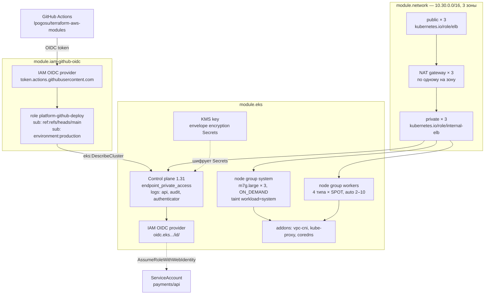

# examples/eks-cluster

Кластер EKS в трёх зонах: приватный эндпоинт API, две группы узлов с разной моделью
мощности, конвертное шифрование Secrets, IRSA и роль для GitHub Actions.
Композиция `network` + `eks` + `iam-github-oidc`.

## Схема



## Две группы узлов

`system` — три узла `m7g.large` (Graviton) фиксированного размера, ON_DEMAND, с taint
`workload=system:NoSchedule`. Здесь живут ingress-контроллер, сбор метрик и логов — то,
исчезновение чего лишает вас видимости ровно в тот момент, когда она нужна.

`workers` — SPOT, автоскейлинг от 2 до 10, четыре типа инстансов сопоставимого размера:
`m7i.large`, `m6i.large`, `m5.large`, `m5a.large`. Четыре типа — это четыре capacity pool.
Отзыв мощности в одном пуле забирает четверть узлов, а не все.

Модуль запрещает SPOT-группу с одним типом инстанса. Это не стилистика: группа на одном
типе исчезает целиком, и на восстановление уходит столько времени, сколько нужно
автоскейлеру, чтобы заметить и поднять новые узлы.

## Приватный эндпоинт по умолчанию

`api_access_cidrs` пуст, поэтому `endpoint_public_access = false` и API-сервер доступен
только изнутри VPC. Kubeconfig берётся через бастион или VPN:

```bash
$(terraform output -raw kubeconfig_command)
kubectl get nodes
```

Чтобы открыть публичный эндпоинт, надо перечислить сети явно. Пустой список при включённом
публичном доступе модуль отвергает: пустой `public_access_cidrs` в API EKS означает
`0.0.0.0/0`, и это единственный случай, когда «оставил по умолчанию» и «открыл миру» —
одно и то же.

## Роль для CI

Роль принимается только из `refs/heads/main` и только через окружение `production`, где
настроены обязательные ревьюеры. Pull request из форка не получает учётных данных вообще.

Сама роль почти ничего не может: `eks:DescribeCluster` и право принять роль
`<cluster>-deployer`. У deployer нет ни одной IAM-политики; всё, что он может внутри
кластера, задано EKS access entry с политикой `AmazonEKSEditPolicy`, ограниченной
пространствами имён из `deploy_namespaces`. Не `AmazonEKSClusterAdminPolicy`: пайплайну,
который выкладывает приложение, незачем править ClusterRoleBinding.

Разделение намеренное: права в кластере расширяются без правки IAM, и наоборот. Плюс
`max_session_duration = 3600` — час, это нижняя граница IAM для роли. Более короткую
сессию запрашивает сам workflow через `role-duration-seconds`; там нижняя граница
уже 900 секунд.

## Запуск

```bash
cp terraform.tfvars.example terraform.tfvars

export AWS_PROFILE=platform
terraform init
terraform apply
```

Роль для CI кладётся в переменную репозитория, а не в секрет — ARN роли не является
секретом:

```bash
gh variable set AWS_DEPLOY_ROLE_ARN --body "$(terraform output -raw ci_role_arn)"
```

## Что это стоит

Прайс `eu-central-1`, on-demand, без учёта трафика:

| Компонент | В месяц |
|---|---|
| control plane EKS, 0.10 USD/час | ~73 USD |
| три NAT-шлюза, 0.052 USD/час каждый | ~114 USD |
| три `m7g.large` ON_DEMAND | ~208 USD |
| два `m*.large` SPOT | ~45 USD |

Для staging `single_nat_gateway = true` убирает две трети счёта за NAT — но только пока
трафик через шлюз небольшой; разбор с точкой безубыточности есть в корневом README.

<!-- BEGIN_TF_DOCS -->
## Requirements

| Name | Version |
|------|---------|
| terraform | >= 1.9.0, < 2.0.0 |
| aws | ~> 5.70 |

## Providers

| Name | Version |
|------|---------|
| aws | ~> 5.70 |

## Resources

| Name | Type |
|------|------|
| [aws_eks_access_entry.deployer](https://registry.terraform.io/providers/hashicorp/aws/latest/docs/resources/eks_access_entry) | resource |
| [aws_eks_access_policy_association.deployer](https://registry.terraform.io/providers/hashicorp/aws/latest/docs/resources/eks_access_policy_association) | resource |
| [aws_iam_role.deployer](https://registry.terraform.io/providers/hashicorp/aws/latest/docs/resources/iam_role) | resource |

## Inputs

| Name | Description | Type | Default | Required |
|------|-------------|------|---------|:--------:|
| api\_access\_cidrs | Source ranges allowed to reach the public Kubernetes API endpoint. Empty list keeps the endpoint private only. | `list(string)` | `[]` | no |
| azs | Availability zones. Three is the smallest number that survives losing one without halving capacity. | `list(string)` | <pre>[<br/>  "eu-central-1a",<br/>  "eu-central-1b",<br/>  "eu-central-1c"<br/>]</pre> | no |
| ci\_create\_oidc\_provider | Create the GitHub OIDC provider. False in an account that already has one, since IAM allows only a single provider per issuer. | `bool` | `true` | no |
| ci\_repository | GitHub repository, as owner/name, whose workflows may assume the deploy role. | `string` | `"lpogosu/terraform-aws-modules"` | no |
| cidr\_block | IPv4 CIDR block of the VPC. | `string` | `"10.30.0.0/16"` | no |
| cluster\_name | Cluster name. Also the prefix of the VPC, the IAM roles and the CI role. | `string` | `"platform"` | no |
| deploy\_namespaces | Kubernetes namespaces the deploy role may edit. The access entry is scoped to these and nothing else. | `list(string)` | <pre>[<br/>  "default",<br/>  "payments"<br/>]</pre> | no |
| kubernetes\_version | Kubernetes minor version of the control plane and the node groups. | `string` | `"1.31"` | no |
| region | AWS region everything is created in. | `string` | `"eu-central-1"` | no |
| single\_nat\_gateway | Route every private subnet through one NAT gateway. Leave false for a cluster that is expected to stay up. | `bool` | `false` | no |
| tags | Tags applied to every resource through the provider default\_tags block. | `map(string)` | <pre>{<br/>  "example": "eks-cluster",<br/>  "managed-by": "terraform"<br/>}</pre> | no |
| workers\_max | Upper bound of the SPOT worker pool. | `number` | `10` | no |
| workers\_min | Lower bound of the SPOT worker pool. | `number` | `2` | no |

## Outputs

| Name | Description |
|------|-------------|
| ci\_role\_arn | Role GitHub Actions assumes. Goes into role-to-assume in the workflow. |
| ci\_trusted\_subjects | Exact sub claims the CI role accepts. |
| cluster\_endpoint | HTTPS endpoint of the Kubernetes API server. |
| cluster\_name | Name of the EKS cluster. |
| deployer\_role\_arn | Role the CI role switches into to talk to Kubernetes. Bound to the cluster by an EKS access entry. |
| kubeconfig\_command | Command that writes a kubeconfig entry for this cluster. |
| nat\_public\_ips | Egress addresses of the cluster, keyed by availability zone. |
| node\_group\_capacity\_types | Capacity type of each node group, so a review can see what runs on SPOT. |
| oidc\_issuer\_host | Issuer without the scheme, the prefix of the sub and aud condition keys in an IRSA trust policy. |
| oidc\_provider\_arn | IAM OIDC provider backing IRSA. The Federated principal of every IRSA trust policy. |
| secrets\_kms\_key\_arn | KMS key performing envelope encryption of Kubernetes Secrets. |
<!-- END_TF_DOCS -->
