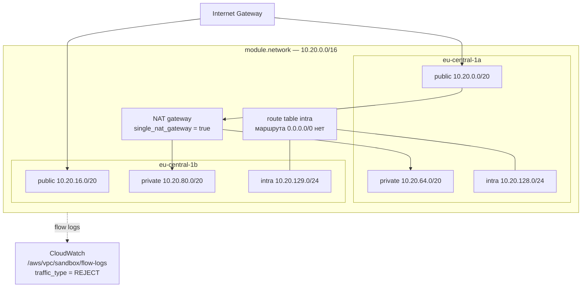

# examples/minimal

Только сеть: VPC, три уровня подсетей в двух зонах, один NAT-шлюз, flow-логи. Самый
дешёвый способ проверить, что модули работают в вашем аккаунте.

## Схема



## Что здесь показано

**Один NAT-шлюз на всю VPC.** `single_nat_gateway = true` — приватные подсети обеих зон
ходят через шлюз в `eu-central-1a`. Для песочницы это правильный выбор, для прода — нет:
падение зоны `a` отрезает от интернета и `b`. Разбор с цифрами — в корневом README.

**Intra-подсети.** Таблица маршрутизации без записи `0.0.0.0/0`. Ресурс в такой подсети
не может открыть исходящее соединение, потому что маршрута нет — не потому что его
запрещает security-группа.

**Flow-логи только по отклонённым пакетам.** `traffic_type = "REJECT"` вместо `ALL`.
При разборе «почему не коннектится» интересны именно отклонения, а объём меньше на
порядок. Retention 30 дней.

**CIDR считаются, а не выписываются.** `cidrsubnet` от базового блока: смена
`cidr_block` или добавление зоны не требует пересчёта адресов руками.

## Запуск

```bash
cp terraform.tfvars.example terraform.tfvars

export AWS_PROFILE=sandbox
terraform init
terraform apply
```

Что это стоит, если оставить включённым: один NAT-шлюз — примерно 38 USD в месяц по
почасовой ставке `eu-central-1` плюс 0.052 USD за гигабайт обработанного трафика;
Elastic IP на нём входит в цену.
VPC, подсети, таблицы маршрутизации и интернет-шлюз бесплатны. Flow-логи оплачиваются как
приём данных в CloudWatch Logs.

```bash
terraform destroy
```

<!-- BEGIN_TF_DOCS -->
## Requirements

| Name | Version |
|------|---------|
| terraform | >= 1.9.0, < 2.0.0 |
| aws | ~> 5.70 |

## Inputs

| Name | Description | Type | Default | Required |
|------|-------------|------|---------|:--------:|
| azs | Availability zones to spread the subnets over. | `list(string)` | <pre>[<br/>  "eu-central-1a",<br/>  "eu-central-1b"<br/>]</pre> | no |
| cidr\_block | IPv4 CIDR block of the VPC. | `string` | `"10.20.0.0/16"` | no |
| name | Name prefix for the VPC and everything in it. | `string` | `"sandbox"` | no |
| region | AWS region everything is created in. | `string` | `"eu-central-1"` | no |
| single\_nat\_gateway | Route both private subnets through one NAT gateway. True here because this example is a sandbox. | `bool` | `true` | no |
| tags | Tags applied to every resource through the provider default\_tags block. | `map(string)` | <pre>{<br/>  "example": "minimal",<br/>  "managed-by": "terraform"<br/>}</pre> | no |

## Outputs

| Name | Description |
|------|-------------|
| flow\_log\_group\_name | CloudWatch log group holding the flow logs. |
| intra\_subnet\_ids | Intra subnet IDs, in the order of var.azs. |
| nat\_public\_ips | Elastic IPs of the NAT gateways, keyed by availability zone. These are the addresses a partner allow-lists. |
| private\_subnet\_ids | Private subnet IDs, in the order of var.azs. |
| public\_subnet\_ids | Public subnet IDs, in the order of var.azs. |
| vpc\_id | ID of the VPC. |
<!-- END_TF_DOCS -->
