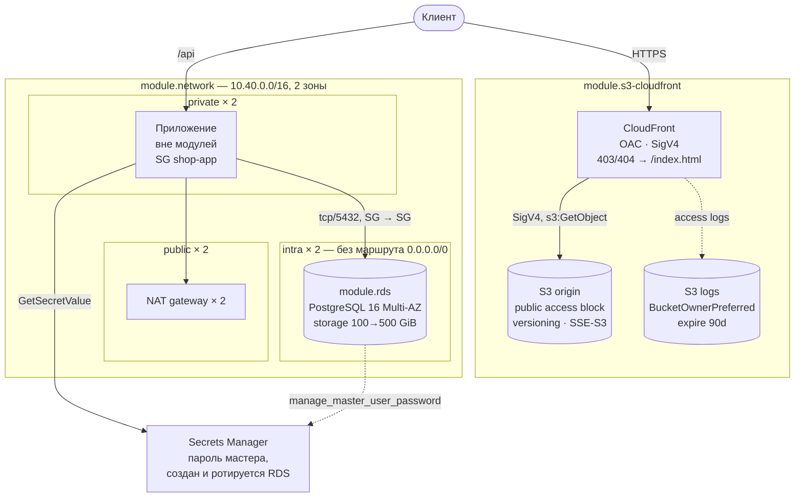

# examples/web-app

Классическое веб-приложение: статический фронтенд на CloudFront поверх закрытого бакета,
PostgreSQL в подсетях без выхода в интернет, security-группа приложения между ними.
Композиция `network` + `rds` + `s3-cloudfront`.

## Схема



## Что здесь показано

**База в intra-подсетях.** У них нет маршрута `0.0.0.0/0`. Это структурное ограничение:
даже при ошибочно расширенной security-группе исходящее соединение из подсети открыть
некуда.

**Доступ к базе по security-группе, а не по CIDR.** Правило ingress ссылается на
`aws_security_group.app`. Переразметка сети не ломает правило, а список того, кто имеет
доступ, читается по имени группы, а не сопоставлением диапазонов.

**Пароль не проходит через Terraform.** `manage_master_user_password = true`: RDS
генерирует пароль, кладёт в Secrets Manager и ротирует. Ни в `tfvars`, ни в state, ни в
выводах его нет — только ARN секрета.

**SPA-роутинг на CloudFront.** 403 и 404 переписываются в `/index.html` с кодом 200.
Без этого прямой переход по глубокой ссылке отдаёт ошибку S3.

**Lifecycle на версионированном бакете.** `noncurrent_version_expiration_days = 30`.
Каждый деплой перезаписывает бандлы, версионирование хранит все предыдущие. Без правила
удаления счёт за хранение растёт линейно и незаметно.

**Логи параметров PostgreSQL.** `log_min_duration_statement = 1000` — по умолчанию
параметр равен `-1`, то есть не логируется ничего, и один запрос без индекса остаётся
невидимым до момента, когда он кладёт сайт. `pg_stat_statements.max` помечен
`pending-reboot`, потому что он выделяет разделяемую память.

## Приложение здесь нет

Слой приложения — ECS, EC2 или EKS — намеренно не входит в библиотеку. Пример владеет
только security-группой `shop-app`, потому что она и есть та идентичность, на которую
ссылается правило доступа к базе.

## Запуск

```bash
cp terraform.tfvars.example terraform.tfvars
# заполнить bucket_name: имена бакетов S3 глобальны

export AWS_PROFILE=shop
terraform init
terraform apply
```

Выкладка фронтенда:

```bash
aws s3 sync ./dist "s3://$(terraform output -raw site_bucket)" --delete
aws cloudfront create-invalidation \
  --distribution-id "$(terraform output -raw site_deploy_commands | head -2 | tail -1)" --paths '/*'
```

Подключение к базе:

```bash
eval "$(terraform output -raw database_psql_command)"
```

## Разбор перед `destroy`

`deletion_protection = true` по умолчанию. Чтобы снести окружение, надо сначала явно
выключить защиту — и это ровно то поведение, ради которого умолчание выбрано таким:

```bash
terraform apply -var deletion_protection=false
terraform destroy
```

Бакеты с объектами тоже не удалятся, пока `force_destroy` не выставлен явно.

<!-- BEGIN_TF_DOCS -->
## Requirements

| Name | Version |
|------|---------|
| terraform | >= 1.9.0, < 2.0.0 |
| aws | ~> 5.70 |

## Providers

| Name | Version |
|------|---------|
| aws | ~> 5.70 |

## Resources

| Name | Type |
|------|------|
| [aws_security_group.app](https://registry.terraform.io/providers/hashicorp/aws/latest/docs/resources/security_group) | resource |
| [aws_vpc_security_group_egress_rule.app_https](https://registry.terraform.io/providers/hashicorp/aws/latest/docs/resources/vpc_security_group_egress_rule) | resource |
| [aws_vpc_security_group_egress_rule.app_postgres](https://registry.terraform.io/providers/hashicorp/aws/latest/docs/resources/vpc_security_group_egress_rule) | resource |

## Inputs

| Name | Description | Type | Default | Required |
|------|-------------|------|---------|:--------:|
| bucket\_name | Globally unique name of the bucket serving the static frontend. | `string` | n/a | yes |
| acm\_certificate\_arn | ACM certificate for the aliases, in us-east-1. Null serves the site on the *.cloudfront.net name. | `string` | `null` | no |
| aliases | Alternate domain names on the distribution. Needs acm\_certificate\_arn. | `list(string)` | `[]` | no |
| azs | Availability zones the subnets are spread over. | `list(string)` | <pre>[<br/>  "eu-central-1a",<br/>  "eu-central-1b"<br/>]</pre> | no |
| cidr\_block | IPv4 CIDR block of the VPC. | `string` | `"10.40.0.0/16"` | no |
| deletion\_protection | Refuse to delete the database. Turn off explicitly to tear the environment down. | `bool` | `true` | no |
| engine\_version | PostgreSQL major version. | `string` | `"16"` | no |
| instance\_class | RDS instance class. | `string` | `"db.t4g.medium"` | no |
| multi\_az | Run a synchronous standby in a second zone. True for anything holding orders. | `bool` | `true` | no |
| name | Name prefix for the VPC, the database and the security groups. | `string` | `"shop"` | no |
| region | AWS region everything except the CloudFront certificate is created in. | `string` | `"eu-central-1"` | no |
| tags | Tags applied to every resource through the provider default\_tags block. | `map(string)` | <pre>{<br/>  "example": "web-app",<br/>  "managed-by": "terraform"<br/>}</pre> | no |

## Outputs

| Name | Description |
|------|-------------|
| app\_security\_group\_id | Security group the application tier attaches to. It is the only source the database accepts. |
| database\_endpoint | Host and port of the PostgreSQL instance. |
| database\_psql\_command | Read the password out of Secrets Manager and open psql. |
| database\_secret\_arn | Secrets Manager secret holding the master password. Grant the application secretsmanager:GetSecretValue on it. |
| site\_bucket | Origin bucket the build output is synced to. |
| site\_deploy\_commands | Sync the bundle and invalidate the edge caches. |
| site\_domain\_name | CloudFront domain name serving the frontend. |
| vpc\_id | ID of the VPC. |
<!-- END_TF_DOCS -->
